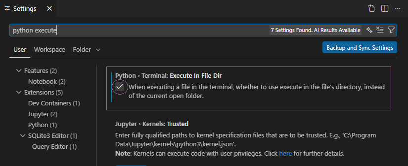

# <span style="color:#f2d3a0"><u>Learnings during our Project:</u></span>

---
## <span style="color:#cae494"><u>1. Using VS Code or Pycharm "Run" was sometimes unreliable.</u></span>
- We started using cmd/PowerShell to run the file in the directory.<br>
``
*your directory* python.\GUI_new.py
``


- *in my case:* <br>
``
D:\Recht\GUI> python .\GUI_new.py
``


- Via ``D:\> tree /f`` you can "print" the directory tree to see where your file is located 
and determine what you need to execute.
````
D:.
└───Recht
    └───GUI
        │   GUI_new.py
        └───__pycache__
````
or you do this in your VS-Code settings if you are cringe 

---
## <span style="color:#cae494"><u>2. In general using the Terminal and useful commands.</u></span>
### <span style="color:#f2d3a0">tree:</span>
Show directory structure<br>
*commands*:
  - ``tree`` <br>
  Displays the folder structure of the current directory.<br><br>
  - ``tree D:\`` <br>
  Shows the folder structure of the D: drive.<br><br>

  - ``tree /f`` <br> 
  Displays all folders and files in the current directory.<br><br>

  - ``tree /a`` <br>
  Uses ASCII characters instead of extended characters (useful for logs or text files).<br><br>
  
### <span style="color:#f2d3a0">cd:</span>
Change directory<br>
*commands*:
- ``cd foldername``<br>
navigate to folder<br><br>
- ``cd ..``<br>
will move you up one level, changing the current directory<br><br>
- ``cd D:\Projects``<br>
specifies the target path where you want to move

#### <span style="color:#aaffaa">*Note*:</span> for cmd the command to change to a directory on a different Drive is
- ``cd /d D:directory\`` <br>
the targeted drive is D:\

###  <span style="color:#f2d3a0">mkdir and rmdir:</span>
an quick way to create and remove Folders<br>
*commands*:
- ``mkdir *folder name*``
  -  creates a Folder in your current directory<br><br>
- ``rmdir *folder name*``
  - will remove the Folder<br><br>
- ``rmdir /s *folder name*``
  - will remove Folder with content

###  <span style="color:#f2d3a0">del:</span>
Delete a file
*command*:
- ``del *file name*``

### <span style="color:#f2d3a0">clear and cls:</span>
clear the Terminal Window
*commands*:<br>
- Powershell
  - ``clear``<br><br>
- cmd
  - ``cls``<br>
### <span style="color:#f2d3a0">python *run file*</span>
- ``python .\*your file*``<br>

for example:<br>
- ``python .\GUI_new.py``
#### <span style="color:#aaffaa">*Note*:</span> You need to be in the same directory as the File.

### <span style="color:#f2d3a0">python version</span>
Check your Python Version installed <br>
- ``python --version``
---
## <span style="color:#cae494"><u>3. Version control: </u></span>
### <span style="color:#94e3c9">We encountered a few problems while working on our Project:</span>
Working exclusively with local versions of the program can quickly become problematic. <br>
As more people work on the project, the risk of breaking something increases, and communication overhead grows significantly.

Team members must constantly check whether someone else is working on the same file, which can slow 
progress and create confusion. In some cases, developers may even avoid working on certain parts of the code altogether 
to prevent conflicts, reducing overall efficiency and collaboration.

### <span style="color:#f2d3a0">GitHub</span>
GitHub has a relatively low learning curve while offering a wide range of powerful features for collaboration and 
version control. You can continue working in your preferred editor, such as PyCharm or VS Code, while using Git in the 
background to track every change you make.

One of GitHub’s biggest advantages is its ability to manage versions efficiently. It allows you to create branches to 
develop new features independently, review changes through pull requests, and merge updates safely into the main project. 
This reduces the risk of conflicts and makes teamwork more structured and transparent.

Additionally, GitHub provides a centralized platform where all project files, history, and discussions are stored in 
one place. This improves collaboration, ensures everyone works with the latest version, and makes it easy to roll back 
to previous versions if something goes wrong.

### <span style="color:#f2d3a0">GitHub, Git clone and ssl</span>
Git Clone Without SSL (Due to Company Restrictions)

In our company network environment, standard SSL-based Git access (HTTPS over port 443) may not function correctly due
to firewall restrictions, SSL inspection, or internal proxy policies. As a result, cloning repositories via HTTPS 
(e.g., https://...) may fail with SSL certificate or connection errors.

To work around this limitation, repositories must be cloned using an alternative protocol that is permitted within the 
company network.<br><br>
instead of: <br>
``git clone *your repository URL*`` <br><br>
use: <br>
``git -c http.sslVerify=false *your repository URL*``

## <span style="color:#cae494"><u>4. Clean Code:</u></span>
Surely i dont have to explain Clean Code in great detail:

Clean code refers to writing software that is easy to read, understand, and maintain. A foundational resource on this topic is Clean Code by Robert C. Martin, which emphasizes meaningful variable and function names, small and focused functions, clear structure, and avoiding unnecessary complexity. In Python development, the PEP 8 style guide plays a central role in maintaining clean code by defining consistent rules for formatting, naming conventions, indentation, and code layout.

Consistency in code is essential for readability and collaboration. Following established standards like PEP 8 ensures that all developers write code in a uniform way, making it easier to understand and maintain. Clear and purposeful comments are also important—they should explain *why* something is done, not just *what* the code does. Additionally, writing meaningful and descriptive commit messages helps track changes, understand the history of a project, and support teamwork. Maintaining consistent language across code, comments, documentation, and user-facing text further improves professionalism, clarity, and long-term maintainability of the software.

well about that...<br>
we fucked up on that part. <br>

sorry

